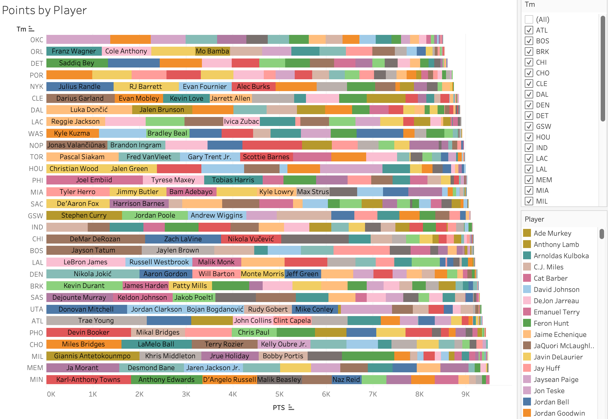
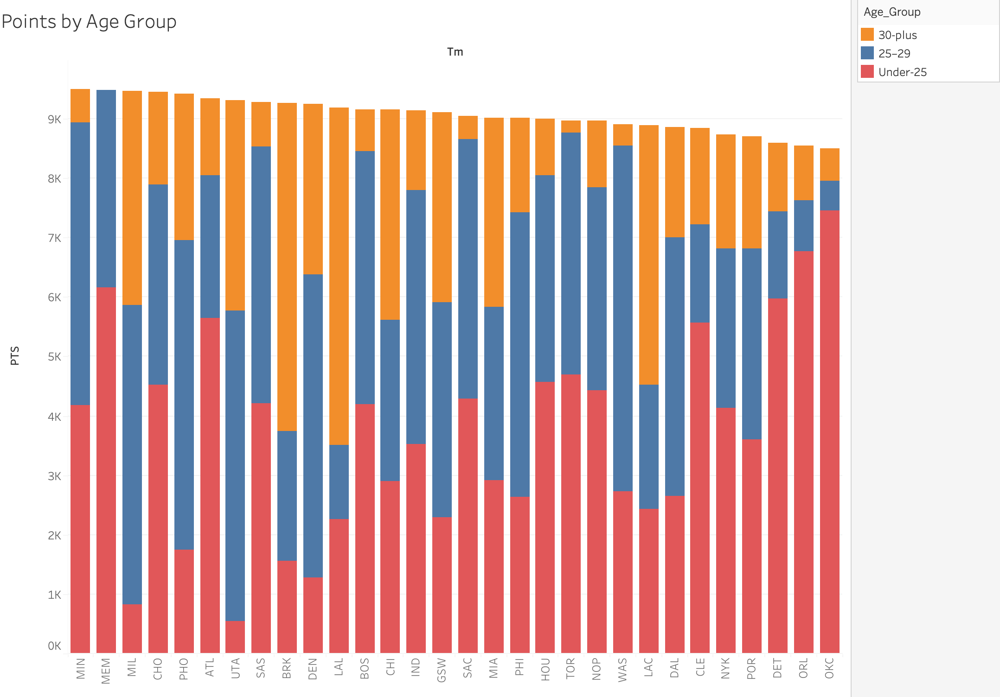
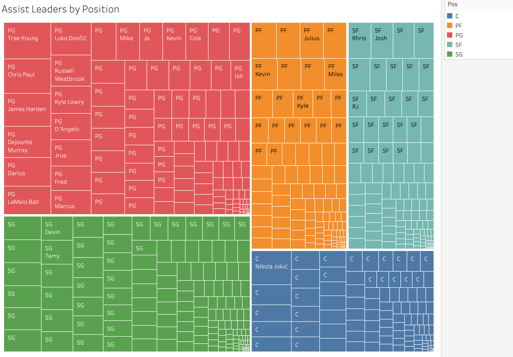

# I Don't Watch Basketball. I Analyzed an Entire NBA Dataset Anyway.

---

## View the Full Tableau Story
[Click here to explore the interactive dashboard](https://public.tableau.com/shared/5ZGRCRZK7?:display_count=n&:origin=viz_share_link)

---

## Why This Project?

I'm always looking for datasets outside my usual domain that can push me to think differently. NBA stats caught my attention because the data is incredibly rich with hundreds of players, dozens of metrics, 30 teams, but I had zero context going in. I don't watch basketball. I never have.

And that was exactly the point.

Most analysts work on data they already understand. You know the business context, you know what the numbers should look like, and you know what questions to ask. This project stripped all of that away. No domain knowledge, no assumptions, no shortcuts. Just the data and the charts.

I wanted to see what pure, unbiased analysis looks like, where the visualization has to do all the explaining because I have nothing else to lean on. What I didn't expect was how much the data would teach me, not just about basketball, but about how to let go of assumptions and just follow the numbers.

---

## Here's Why You Should Keep Reading

Three things I found that are worth your next 3 minutes:

- A player type that's supposed to stay near the basket is now one of the best long-range shooters in the league and the numbers back it up
- One entire NBA team has no player older than 28 on their roster. Not one. It's a deliberate bet on youth that shows up clearly in the data.
- One player leads the entire league in both scoring AND assists simultaneously and another player at a completely different position is somehow out rebounding, out-scoring, and out-passing almost everyone else in the league

If any of those made you curious, keep reading.

---

## What & Where of Dataset

The dataset contains individual player statistics for every NBA player across all 30 teams.

Each row is one player.

The columns cover points scored, assists, rebounds, three-point attempts and shooting percentage, field goal percentage, age, and position etc.

It spans a full NBA season with hundreds of player records more than enough to surface real patterns rather than just isolated highlights.

The 5 positions referred to in the analysis:

| Abbreviation | Position |
|---|---|
| PG | Point Guard |
| SG | Shooting Guard |
| SF | Small Forward |
| PF | Power Forward |
| C | Center |

---

## Data Cleaning — Position Standardization in Tableau

- Some players were traded between teams during the 2022 season, resulting in combined position labels such as PG-SG or SF-PF-C in the raw dataset
- These multi-position entries reflected roster moves and mid-season trades
- A calculated field was created in Tableau to extract only the leftmost position from each entry
- Used the LEFT and FIND functions to isolate the primary position before the first hyphen
- This ensured every player was assigned a single, consistent position label
- Made position-based comparisons across all five charts clean and reliable

---

## All Analysis

### 1. 3-Point Efficiency by Position (Heat Map)

*Team vs Position of the player*

Before I could even read this chart, I had to Google what the positions actually meant. Centers, apparently, are the tallest players on the court, the ones who traditionally stay near the basket and score up close.

So when I saw that Atlanta Hawks (ATL) Centers were shooting 42% from three-point range (29 makes out of 69 attempts), I had no frame of reference for whether that was impressive. I asked someone who follows the sport. They told me that's elite for any position, let alone Centers.

On the opposite end, Utah Jazz (UTA) Centers attempted just 4 three-pointers the entire season and made zero goals. Same position label, completely opposite style of play.

I chose a heat map for this because I needed to compare 30 teams across 5 positions simultaneously. A table of 150 cells would've buried the story. Color surfaces it immediately and the eye goes straight to the darkest and lightest cells without any effort.

---

### 2. Player Performance Bubble Chart (Points vs Assists vs Rebounds vs Position)

*PTS - Points scored, AST - Assists, Size of the bubble - Total Rebounds (TRB), Color of the bubble - Position of the player*

I wanted to understand who the standout players were, but "best" means different things. Best scorer? Best passer? Best rebounder? A bubble chart lets me show all three at once without having to pick.

- Left to Right = Total Points
- Bottom to Top = Total Assists
- Bubble Size = Total Rebounds
- Color = Position

The first player I noticed was Trae Young, a Point Guard sitting completely alone in the top right corner with 2,155 points and 737 assists. I checked the rest of the dataset. He ranks 1 in the entire league in both scoring AND assists at the same time. Even without knowing who he is, the chart immediately tells that he's doing something no one else is.

But the player that genuinely stopped me was Nikola Jokić. He plays Center, the position that's supposed to stay near the basket, the big guy whose job is to grab the ball and score up close. Yet his bubble is the largest on the entire chart (1,019 rebounds, ranks 1 in the whole league), it sits higher up the assists axis than most point guards with 584 assists, and he's the 5th highest scorer in the dataset with 2,004 points.

To put that into perspective: he is the only Center in the entire dataset with 500 or more assists. The next closest Center has just 349. Every other big man is nowhere near him.

I asked a basketball fan if this was normal. They said it is very much not normal.

His bubble sits in a part of the chart where no Center should be and that's exactly the kind of thing a bubble chart is built to reveal. A ranked list of stats would never have made me feel how out of place, and how extraordinary, that dot actually is.

---

### 3. Points by Player (Stacked Bar by Team)

*PTS - Points, Tm - Team Name*

A simple question drove this chart: do all teams rely on one superstar, or do some spread the scoring around? Each bar represents a team's total points, and each colored segment inside is one player's contribution.

The Minnesota Timberwolves (MIN), Memphis Grizzlies (MEM), and Milwaukee Bucks (MIL) are highest scoring teams, with several roughly equal segments, no single player carrying the whole load. Other teams towards the top end of the chart show one very long first segment then a sharp drop-off, visually telling that this team depends on one person.

One can read the entire team-building philosophy of a franchise just from the shape of a bar, without knowing a single player's name.

---

### 4. Points by Age Group (Stacked Bar)

*Tm - Team name, PTS - Points scored by the team*

I went into this chart with a clear assumption: younger players probably outscore older ones. Faster, more athletic, more energy. The data corrected me.

The most extreme case is the Memphis Grizzlies (MEM). Their entire roster is under 29 years old, their oldest player is 28. They haven't signed a single player aged 30 or above. It's not that their older players don't score, they simply don't have any. That's a conscious decision to build entirely around youth, and it shows up immediately in the chart as the only bar with no orange segment at all.

The Minnesota Timberwolves (MIN) tell a similar story with 4,182 points from players under 25, with only 562 from players aged 30 and older. Two franchises making the same generational bet, in different ways.

But then the Los Angeles Lakers (LAL), Brooklyn Nets (BRK), and Los Angeles Clippers (LAC) each get well over 4,000 points from their 30-plus players with the Milwaukee Bucks (MIL) not far behind at 3,610. Veterans are far from finished. My original assumption was wrong and this chart is exactly what showed me why.

---

### 5. Assist Leaders by Position (Treemap)

The logic is simple: bigger rectangle = more assists.

I chose it over a ranked bar chart because I also wanted to show which position each player belongs to, grouping them visually in a way a bar chart can't do cleanly.

The Point Guard section dominates, Trae Young, Luka Dončić, Chris Paul all have huge rectangles. I looked up what Point Guards do: they're the primary playmakers, the ones whose job is to set up scoring for teammates. The chart confirmed that perfectly.

But then Nikola Jokić appears, in the Center section, with a rectangle bigger than most guards. 584 assists from the player whose position is supposed to keep him near the basket. The treemap makes that anomaly impossible to miss.

This was my favourite chart to build. You feel the size difference rather than just reading it and that's what good visualization should do.

---

## Three things I want you to leave with

First, position labels in basketball are becoming less meaningful, Centers are hitting elite three-pointers and racking up assists that traditionally belong to guards.

Second, team-building philosophies are more extreme than you'd expect, Memphis has deliberately built a roster with nobody older than 28. That's not an accident, it's a strategy, and the age group chart makes it completely visible.

Third, Nikola Jokić is doing something the data says almost nobody else does, leading all Centers in assists by a margin so large it barely looks like the same sport. His bubble on Chart 2 sits somewhere it has no right to be. That's the most memorable thing I found in this entire dataset.

---

To any basketball fans reading — if I've misread anything, please correct me in the comments. I'm learning the sport through its data, and getting things wrong is part of the process.

---

Thank you for reading!

I would love to know what patterns you noticed in the data or what questions you would ask next. Drop them in the comments.

And if you are looking for a data analyst who builds systems that surface what single metrics cannot show, I am actively looking for my next role. Let's connect.

---

## Tools Used

- Tableau Public (data cleaning, analysis, and visualisation)

## Data

- NBA 2022 regular season statistics

