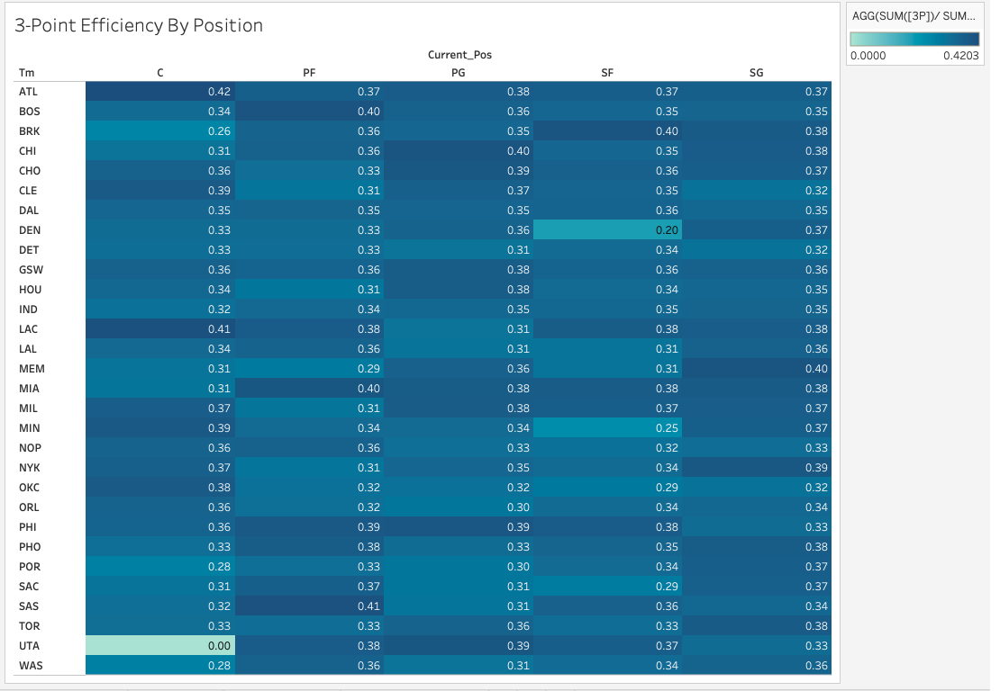
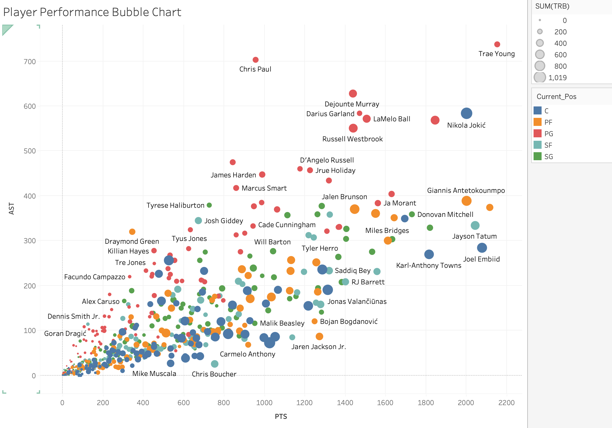

# I Don't Watch Basketball. I Analyzed an Entire NBA Dataset Anyway.

---

## View the Full Tableau Story
[Click here to explore the interactive dashboard](https://public.tableau.com/shared/5ZGRCRZK7?:display_count=n&:origin=viz_share_link)

---

## Why This Project?

I'm always looking for datasets outside my usual domain that can push me to think differently. NBA stats caught my attention because the data is incredibly rich with hundreds of players, dozens of metrics, 30 teams, but I had zero context going in. I don't watch basketball. I never have.

And that was exactly the point.

Most analysts work on data they already understand. You know the business context, you know what the numbers should look like, and you know what questions to ask. This project stripped all of that away. No domain knowledge, no assumptions, no shortcuts. Just the data and the charts.

I wanted to see what pure, unbiased analysis looks like, where the visualization has to do all the explaining because I have nothing else to lean on. What I didn't expect was how much the data would teach me, not just about basketball, but about how to let go of assumptions and just follow the numbers.

---

## Here's Why You Should Keep Reading

Three things I found that are worth your next 3 minutes:

- A player type that's supposed to stay near the basket is now one of the best long-range shooters in the league and the numbers back it up
- One entire NBA team has no player older than 28 on their roster. Not one. It's a deliberate bet on youth that shows up clearly in the data.
- One player leads the entire league in both scoring AND assists simultaneously and another player at a completely different position is somehow out rebounding, out-scoring, and out-passing almost everyone else in the league

If any of those made you curious, keep reading.

---

## What & Where of Dataset

The dataset contains individual player statistics for every NBA player across all 30 teams.

Each row is one player.

The columns cover points scored, assists, rebounds, three-point attempts and shooting percentage, field goal percentage, age, and position etc.

It spans a full NBA season with hundreds of player records more than enough to surface real patterns rather than just isolated highlights.

The 5 positions referred to in the analysis:

| Abbreviation | Position |
|---|---|
| PG | Point Guard |
| SG | Shooting Guard |
| SF | Small Forward |
| PF | Power Forward |
| C | Center |

---

## Data Cleaning — Position Standardization in Tableau

- Some players were traded between teams during the 2022 season, resulting in combined position labels such as PG-SG or SF-PF-C in the raw dataset
- These multi-position entries reflected roster moves and mid-season trades
- A calculated field was created in Tableau to extract only the leftmost position from each entry
- Used the LEFT and FIND functions to isolate the primary position before the first hyphen
- This ensured every player was assigned a single, consistent position label
- Made position-based comparisons across all five charts clean and reliable

---

## All Analysis

### 1. 3-Point Efficiency by Position (Heat Map)

*Team vs Position of the player*

Before I could even read this chart, I had to Google what the positions actually meant. Centers, apparently, are the tallest players on the court, the ones who traditionally stay near the basket and score up close.

So when I saw that Atlanta Hawks (ATL) Centers were shooting 42% from three-point range (29 makes out of 69 attempts), I had no frame of reference for whether that was impressive. I asked someone who follows the sport. They told me that's elite for any position, let alone Centers.

On the opposite end, Utah Jazz (UTA) Centers attempted just 4 three-pointers the entire season and made zero goals. Same position label, completely opposite style of play.

I chose a heat map for this because I needed to compare 30 teams across 5 positions simultaneously. A table of 150 cells would've buried the story. Color surfaces it immediately and the eye goes straight to the darkest and lightest cells without any effort.

---

### 2. Player Performance Bubble Chart (Points vs Assists vs Rebounds vs Position)

*PTS - Points scored, AST - Assists, Size of the bubble - Total Rebounds (TRB), Color of the bubble - Position of the player*

I wanted to understand who the standout players were, but "best" means different things. Best scorer? Best passer? Best rebounder? A bubble chart lets me show all three at once without having to pick.

- Left to Right = Total Points
- Bottom to Top = Total Assists
- Bubble Size = Total Rebounds
- Color = Position

The first player I noticed was Trae Young, a Point Guard sitting completely alone in the top right corner with 2,155 points and 737 assists. I checked the rest of the dataset. He ranks 1 in the entire league in both scoring AND assists at the same time. Even without knowing who he is, the chart immediately
